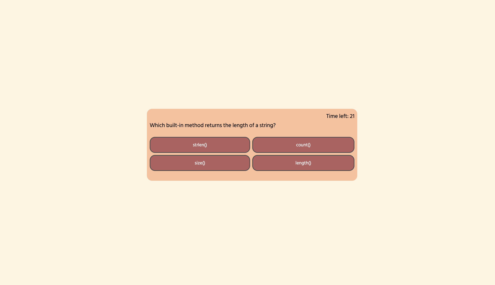

# Timed Quiz
  
  
  
  
  ## Description
  
  Timed Quiz provides a set of questions relating to JavaScript to test your knowledge in 60 seconds. If the incorrect answer is selected then 10 seconds are removed from the timer and if the correct answer is selected then 10 seconds is added. When all questions are answered, the user is prompted to enter their initials and the remaining time is stored as the score in localstorage and the leaderboard is displayed

    

  ## Table of Contents
  
  - [Installation](#installation)
  - [Usage](#usage)
  - [Credits](#credits)
  - [License](#license)

   
  
  ## Installation

      none

  
   

  ## Usage

  go to the website https://andyr-dev.github.io/timed-quiz

   
  
  ## Credits

      Github: andyr-dev Email: andy3942@gmail.com
  
  ## License

  This project is licensed under the  license.
  
   

  ## Badges

    

   
  
  ## Questions

  If you have any questions, please feel free to email me at andy3942@gmail.com

  [Link to my GitHub](https://github.com/andyr-dev/)
  
   

  ## How to Contribute

  send an email to Andy3942@gmail.com to contribute

   
  
  ## Test
      none